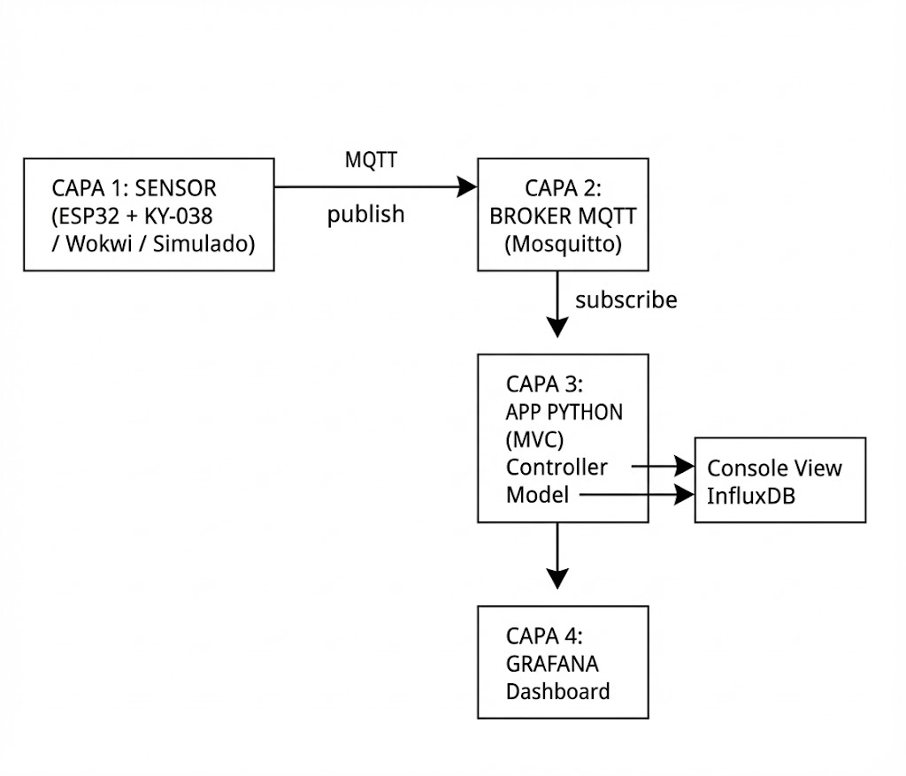

<div align="center">

# Proyecto IoT: Monitorización de Ruido Ambiental

**Alumno:** Antonio Ortega Góngora  
**Asignatura:** Programación de Inteligencia Artificial  
**Curso:** 2025-2026  

</div>

---

## Descripción

Sistema IoT que mide y monitoriza los niveles de ruido en distintas ubicaciones. Recoge datos de decibelios (reales o simulados), los clasifica por nivel de intensidad (bajo, moderado, alto, peligroso) y los muestra en un dashboard visual.

---

## Arquitectura



El sistema se compone de:

- **Sensor / Simulador** — Genera las lecturas de ruido.
- **Mosquitto (MQTT)** — Broker de mensajería que comunica el sensor con la aplicación.
- **Aplicación Python** — Recibe las lecturas, las procesa y las guarda en la base de datos. Sigue el patrón MVC.
- **InfluxDB** — Base de datos donde se almacenan las lecturas con su marca de tiempo.
- **Grafana** — Dashboard web para visualizar los datos en tiempo real.

---

## Tecnologías

- Python 3.11+
- MQTT (Mosquitto)
- InfluxDB
- Grafana
- Docker / Docker Compose
- pytest

---

## Cómo ejecutar

**1. Clonar e instalar:**

```bash
git clone https://github.com/Elisandil/programacion-de-inteligencia-artificial.git
cd programacion-de-inteligencia-artificial/proyecto_ruido
pip install -r requirements.txt
```

**2. Crear el archivo `.env`** con las credenciales necesarias (ver `.env.example`).

**3. Levantar los servicios:**

```bash
docker-compose up -d
```

**4. Ejecutar la aplicación:**

```bash
python -m app.main
```

Se mostrará un menú con tres opciones: monitor en tiempo real, simulación o generación de dataset.

**5. Acceder a los dashboards:**

- Grafana: [http://localhost:3000](http://localhost:3000)
- InfluxDB: [http://localhost:8086](http://localhost:8086)

---

## Tests

```bash
python -m pytest tests/ -v
```

El proyecto incluye 21 tests unitarios que cubren el modelo de datos, los controladores y el generador de datasets.
