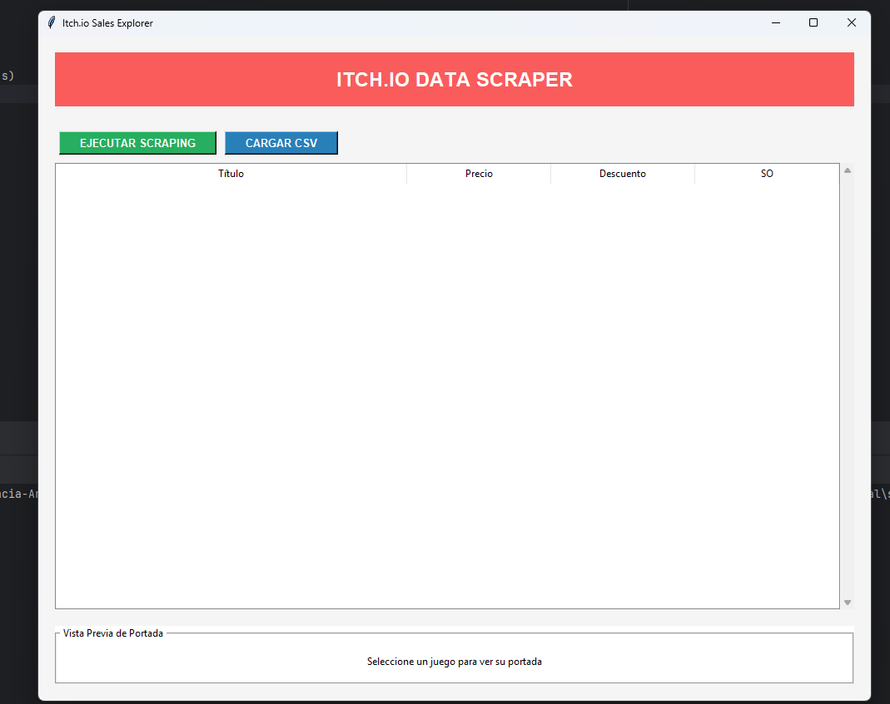
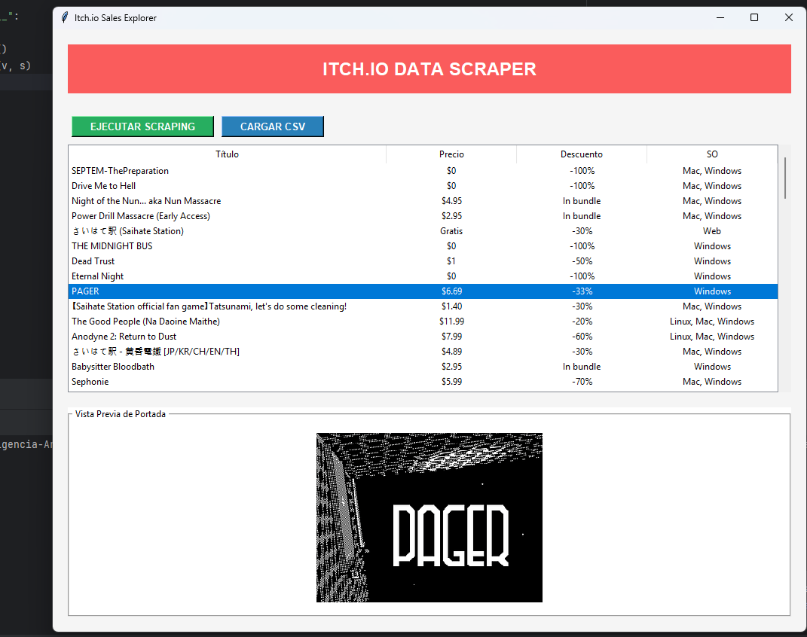
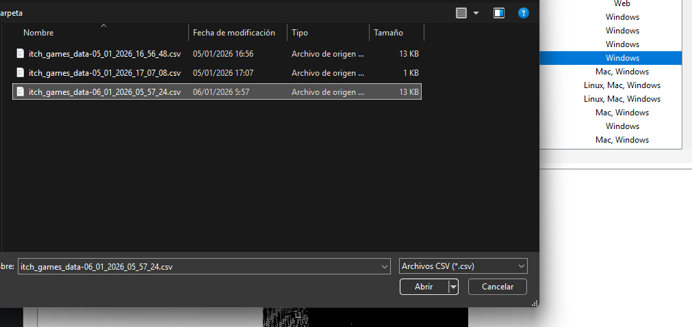

# Itch.io Sales Explorer (Scraper + GUI)

## ¿Para qué sirve?
Aplicación de escritorio (Tkinter) que extrae juegos en oferta de **itch.io** (sección *on-sale*), los muestra en una tabla y permite:
- Guardar los resultados en un **CSV** con timestamp.
- Cargar un **CSV** previamente guardado.
- Ver la **portada** del juego al seleccionar una fila (descargando la imagen desde su URL).

## ¿Por qué esta arquitectura?
Se usa una separación tipo **MVC** (Model–View–Controller) para mantener el proyecto simple y mantenible:
- **Model (`model.py`)**: define el dato `Game` y su conversión a diccionario/CSV.
- **View (`view.py`)**: solo UI (botones, tabla, panel de imagen). No sabe cómo se hace el scraping.
- **Controller (`controller.py`)**: orquesta acciones del usuario (scraping, cargar CSV, seleccionar fila) y actualiza la vista.
- **Service (`scraper_service.py`)**: encapsula el scraping (requests + BeautifulSoup). Así se puede cambiar la fuente o el parseo sin tocar la UI.

Esta separación evita mezclar red/HTML con widgets, facilita depurar y permite evolucionar cada parte sin romper las otras.

## Estructura rápida
- `main.py`: punto de entrada.
- `scraper_service.py`: descarga y parsea juegos desde `https://itch.io/games/on-sale`.
- `controller.py`: guarda CSV en `data/` y gestiona eventos.
- `view.py`: tabla y preview de imagen.
- `strings.py`: constantes (textos, columnas, rutas, formatos).
- `data/`: carpeta donde se generan los CSV.

## Requisitos
- Python 3.13, o cualquier version 3.X.
- Dependencias: `requests`, `beautifulsoup4`, `pandas`, `Pillow`

## Instalación:
```bash
pip install -r requirements.txt
```

## Screenshots:




